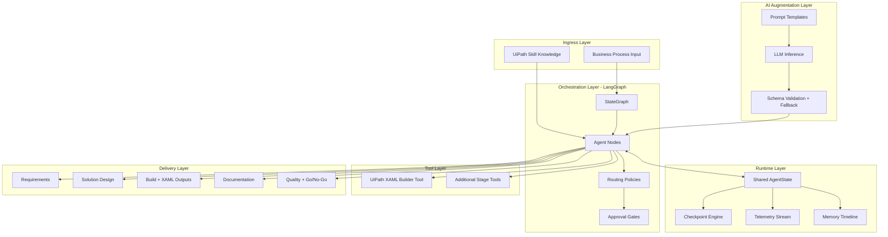
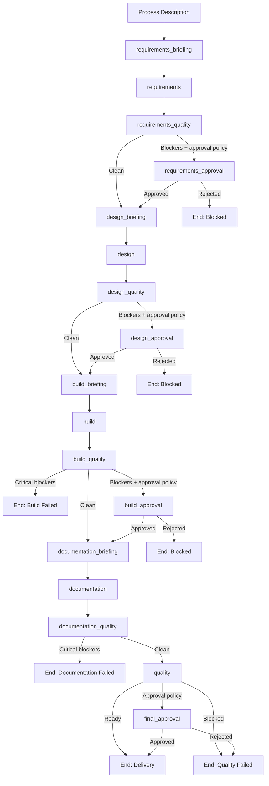
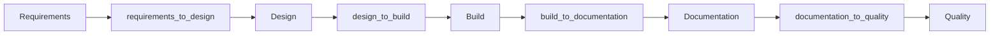

# UiPath Multi-Agent System Architecture

## Abstract

This system architecture describes a LangGraph-driven, multi-agent pipeline that transforms a process description into a governed automation delivery package. It is designed to be technically rigorous for engineering teams and decision-ready for delivery management.

Delivery package outputs:
1. Requirements specification
2. Solution design
3. Build artifacts and workflow notes
4. Operational documentation
5. Final quality and go/no-go assessment

## 1. Architecture Objectives

| Objective | Mechanism | Expected Result |
|---|---|---|
| Consistency | Typed shared state + stage handovers | Cross-stage artifact coherence |
| Governance | Quality gates + approval nodes | Controlled progression and release decisions |
| Reliability | Checkpointing + resume + deterministic fallback | Stable operation under partial failures |
| Throughput | Linear core graph with conditional branching | Fast execution for standard use cases |

## 2. LangGraph Framework Structure

LangGraph is the orchestration kernel. The system compiles a StateGraph where each node consumes and emits the same shared state object. This enables deterministic transitions, conditional routing, and explicit terminal states.

Framework roles:
1. Node execution ordering
2. Conditional edge routing from quality signals
3. Lifecycle control for approvals and failures
4. Predictable terminal outcomes

## 2.2 Agent Composition and Tool Contract

Each stage agent follows a strict composition model:
1. Skill/role: defines what decisions the agent owns.
2. Context: phase-level context, shared skill context, and runtime metadata.
3. Tools: explicit executable capabilities invoked by the agent.

Contract guarantees:
1. Agent decisions remain separated from tool execution logic.
2. Tool invocations are inspectable and auditable as architecture components.
3. Stage behavior remains extensible by swapping or adding tools without changing orchestration topology.

## 2.1 Embedded Technical Architecture (System View)

Interpretation:
1. LangGraph owns stage execution and branching semantics.
2. Shared state is the continuity plane between all nodes and layers.
3. Runtime services provide recoverability and operational traceability.
4. UiPath skill knowledge informs architecture decisions and XAML/activity generation.
5. Tool layer executes concrete build/runtime actions independently from agent decision logic.
6. LLM augmentation is constrained by schema validation and deterministic fallback.

## 3. Agent Node Catalog

### 3.1 Core stage nodes

| Node | Role | Primary Output |
|---|---|---|
| requirements_briefing | Prepares requirement context | Briefing packet |
| requirements | Extracts and structures requirements | Requirements artifact |
| requirements_quality | Validates requirement completeness | Issues/blockers signal |
| design_briefing | Prepares design context | Design briefing packet |
| design | Creates architecture decisions | Solution design artifact |
| design_quality | Validates design quality | Issues/blockers signal |
| build_briefing | Prepares build plan context | Build briefing packet |
| build | Plans build outputs and invokes build tools | XAML scaffold and notes |
| build_quality | Validates build output readiness | Issues/blockers signal |
| documentation_briefing | Prepares documentation context | Documentation briefing packet |
| documentation | Generates runbook-style documentation | Documentation artifact |
| documentation_quality | Validates docs operational quality | Issues/blockers signal |
| quality | Consolidates release readiness | Final quality report |

### 3.2 Governance and terminal nodes

| Node type | Nodes | Purpose |
|---|---|---|
| Approval nodes | requirements_approval, design_approval, build_approval, final_approval | Human-in-the-loop decisions |
| Terminal success | delivery | Delivery complete |
| Terminal blocked | requirements_approved, design_approved, build_approved, quality_failed | Rejection or blocked progression |
| Terminal failure | build_failed, documentation_failed | Critical technical stop |

## 4. End-to-End System Flow

## 5. Data Flow and State Contracts

### 5.1 Shared state domains

| Domain | Content |
|---|---|
| Input domain | process description, skill context, project directory |
| Artifact domain | requirements, design, build, documentation, quality outputs |
| Governance domain | stage quality checks, blocker lists, approval outcomes |
| Runtime domain | run metadata, checkpoint history, telemetry, memory snapshots, errors |

### 5.2 Handover packet flow

Handover guarantees:
1. Stage outputs are explicitly passed forward.
2. Quality findings remain attached to downstream context.
3. Missing context is reduced through briefing + handover composition.

## 6. UiPath Delivery Capability Model

The solution is designed to understand and generate UiPath patterns, including:

### 6.1 REFramework awareness

Decision capability includes:
1. Recognizing when REFramework is required based on complexity, exception handling, and transaction semantics.
2. Producing design guidance aligned with REFramework phases and control logic.
3. Emitting quality criteria that validate REFramework suitability.

### 6.2 Dispatcher/Performer model

Design capability includes:
1. Evaluating queue-based separation needs.
2. Recommending Dispatcher/Performer where workload partitioning or parallelization is required.
3. Documenting trade-offs for single-process vs split-process topologies.

### 6.3 XAML generation with UiPath activity guidance

Build capability includes:
1. Creating `.xaml` workflow artifacts and project scaffold outputs through a dedicated UiPath XAML builder tool.
2. Structuring workflows from design-time architecture decisions.
3. Generating activity-oriented implementation notes grounded in UiPath skill context.

Tool boundary model:
1. Build agent decides what to generate based on approved design context.
2. UiPath XAML builder tool executes file generation for project.json, Main.xaml, sub-workflows, and workflow architecture notes.
3. Build outputs are returned into shared state for downstream quality and documentation stages.

## 7. Runtime Reliability and Observability

Per-node instrumentation pipeline:
1. Start stage timer
2. Execute node
3. Persist checkpoint snapshot
4. Append telemetry event
5. Append compact memory snapshot
6. Persist failed checkpoint and error on exception

Runtime artifacts:
1. `artifacts/checkpoints/<run_id>/<node>.json`
2. `artifacts/memory/<run_id>.ndjson`
3. `artifacts/telemetry/<run_id>.json`

Recovery behavior:
1. Resume from latest checkpoint
2. Skip nodes already marked completed
3. Continue with preserved runtime metadata

## 8. LLM and Deterministic Co-Processing

Policy controls:
1. `LLM_FIRST`: model-preferred generation
2. `LLM_REQUIRED`: fail-fast if model unavailable

Invocation contract:
1. Build reasoning context from state
2. Load stage prompt
3. Invoke model
4. Parse structured JSON
5. Validate required keys
6. Retry with backoff
7. Merge valid payload or deterministic fallback

Operational guarantee:
- The system continues with deterministic baselines when model output is unavailable or invalid.

## 9. Management Operating View

Recommended KPIs:
1. Delivery readiness rate
2. Approval escalation rate
3. Stage latency (mean and p95)
4. Blocker concentration by stage
5. Resume/rework rate
6. LLM fallback rate

Decision usage:
1. Tune approval policy thresholds by escalation trend.
2. Prioritize optimization by stage latency and blocker hotspots.
3. Monitor fallback ratio to evaluate model reliability and cost/performance posture.

## 10. Risk and Control Framework

| Risk | Primary Control |
|---|---|
| Requirement ambiguity | Clarification flow and requirement quality gate |
| Inconsistent downstream outputs | Formal stage handovers and shared state contract |
| Governance bypass | Approval nodes on blocker-driven transitions |
| LLM output variability | Schema validation, retries, deterministic fallback |
| Runtime recoverability gaps | Mandatory checkpoint + telemetry persistence |

## 11. Evolution Strategy

To extend the architecture safely:
1. Add node and state-field changes together.
2. Add or update routing policy before enabling new branch paths.
3. Define quality criteria for each new stage before promotion.
4. Keep telemetry schema additive.
5. Preserve checkpoint compatibility with defaulted fields.

Guiding principle:
- Evolve capabilities without breaking state contracts, governance controls, or recoverability guarantees.
