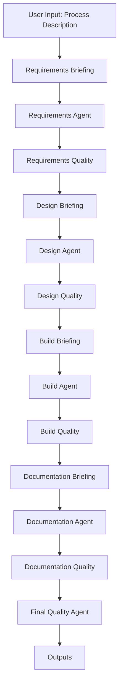

# UiPath Multi-Agent System Architecture

## Overview

The system is **LLM-first**: each stage prioritizes model reasoning and uses deterministic logic as fallback. It converts one process description into requirements, design, build artifacts, documentation, and quality review.

Core principle: better decisions come from better context. Every stage publishes a structured handover packet with a normalized reasoning context for downstream agents.

## Execution Graph

The graph is linear in core execution, with conditional routing and approval gates configured in the orchestrator.

## LLM-First Runtime Policy

| Setting | Default | Behavior |
|---|---|---|
| `LLM_FIRST` | `true` | Prefer model reasoning at all major stages |
| `LLM_REQUIRED` | `false` | If `true`, fail fast when LLM is unavailable |
| `OPENAI_API_KEY` | not set | Enables model invocation |
| `LLM_MODEL` | `gpt-4o-mini` | Selects model used by all agents |

Fallback policy:
- If LLM is unavailable and `LLM_REQUIRED=false`, deterministic logic continues execution.
- If `LLM_REQUIRED=true`, execution fails early with explicit error.

## Reasoning Context Generation

Each agent builds a **reasoning context packet** from shared state before calling the LLM.

Context packet includes:
- Process overview and systems
- Business rules, exceptions, open questions
- Upstream quality findings
- Lifecycle handover packets
- Briefing summaries
- Stage-specific metadata (architecture choice, workflows, quality focus)

Benefits:
- Reduces hallucinations by grounding prompts in structured state
- Improves stage-to-stage coherence
- Preserves traceability for audit and debugging

## Data Model and Handover Contracts

`AgentState` is the shared data contract across the graph.

Primary domains:
- Core artifacts: requirements, design, build, documentation, quality
- Context: `skill_context`, `agent_context`, `briefings`
- Quality telemetry: `stage_quality_checks`
- Governance: `human_gates`, `errors`
- Handover packets: `lifecycle_handover`

Handover packets explicitly carry execution-critical fields and now include `reasoning_context_packet` at each transition:
- `requirements_to_design`
- `design_to_build`
- `build_to_documentation`
- `documentation_to_quality`

## Agent Pattern

Each core agent follows this implementation pattern:
1. Load stage system prompt
2. Compose deterministic baseline output
3. Build stage-specific reasoning context packet
4. Invoke LLM with schema-constrained JSON response
5. Merge structured LLM output into baseline
6. Persist artifact file and handover packet
7. Run quality gate and approval logic

This pattern preserves reliability while maximizing reasoning depth.

## Quality and Governance Model

Governance is integrated into runtime, not bolted on:
- Stage-level quality agents score completeness and flag issues
- Approval gates can halt progression on blockers
- Final quality consolidates upstream findings and release readiness

Typical terminal outcomes:
- Delivery ready
- Blocked (approval rejected)
- Failed (critical technical issues)

## Output Artifacts

The pipeline writes:
- `outputs/01_requirements.md`
- `outputs/02_solution_design.md`
- `outputs/03_build_notes.md`
- `outputs/04_documentation.md`
- `outputs/05_code_quality_review.md`
- `outputs/uipath_project/*` (generated XAML scaffold)

## Extensibility

The architecture is designed for controlled evolution:
- Add or replace stage agents without breaking state contract
- Extend context packet schema per stage
- Add advanced routing (retries/escalations) in orchestrator
- Swap LLM provider while preserving JSON-schema interface