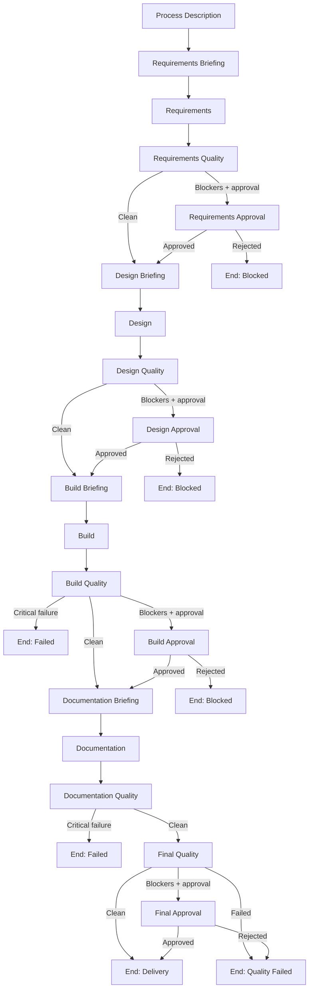

# Architecture

## Executive-Technical Summary

The platform is a stateful, multi-stage delivery system built on LangGraph. It transforms one business-process description into five aligned artifacts: requirements, design, build, documentation, and quality assessment. The architecture is designed for governance, repeatability, and fast execution.

## System Goal

| Objective | Architectural Mechanism | Outcome |
|---|---|---|
| Delivery speed | Linear core execution with cached briefing context | 15-25 second typical end-to-end run |
| Output consistency | Shared state + formal handover packets | Coherent cross-stage artifacts |
| Governance | Conditional approval gates and terminal statuses | Controlled release decisions |
| Operational resilience | Deterministic fallback and early-stop routing | Predictable behavior under failures |

## Layered Architecture

| Layer | Technology | Responsibility |
|---|---|---|
| Orchestration | LangGraph StateGraph | Node execution, routing, and lifecycle control |
| Agent Runtime | Python (async-compatible) | Stage logic and artifact generation |
| Data Contract | Pydantic `AgentState` | Shared, typed state across all stages |
| Reasoning | OpenAI via LangChain (optional) | Enrichment, inference, clarifications |
| Deterministic Logic | Rule-based extraction and defaults | Stable fallback without LLM |

## Lifecycle Topology

Core lifecycle stages:
1. Requirements
2. Design
3. Build
4. Documentation
5. Quality

Execution topology:
- 13 core nodes (briefing + agent + quality pattern)
- 4 approval nodes
- 7 terminal nodes
- Linear core with conditional branches

## Shared State and Data Contracts

The architecture uses one `AgentState` object as the source of truth across all nodes.

Core state domains:
- Business input: process description and context
- Stage artifacts: requirements, design, build, documentation, quality
- Quality telemetry: stage findings, issues, blockers
- Handover contracts: `requirements_to_design`, `design_to_build`, `build_to_documentation`, `documentation_to_quality`
- Governance signals: approvals, phase status, errors

Why this matters:
- No hidden dependencies between agents
- Full traceability from input to terminal state
- Deterministic replay and easier testing

## Design Patterns Implemented

| Pattern | Implementation | Benefit |
|---|---|---|
| Lifecycle handover pattern | Structured per-stage handover packets | Clear stage interfaces |
| Stateful collaboration pattern | Shared `AgentState` across all nodes | No duplicate extraction effort |
| Design-driven generation pattern | Build outputs derive from requirements/design | Meaningful workflow structure |
| Quality-gate pattern | Stage-level checks before progression | Early risk detection |

## Knowledge and Reasoning Model

The system combines four knowledge sources:
1. Process description (primary intent)
2. UiPath skills repository (domain constraints and patterns)
3. Deterministic heuristics (stable defaults)
4. Optional LLM reasoning (ambiguity reduction, insight generation)

Reasoning policy:
- Deterministic-first behavior for reliability
- LLM enhancement when credentials/config are available
- Structured outputs enforced via JSON-like response schema
- Clarification-first handling for unresolved ambiguities

## Orchestration and Control Logic

Routing policy:
1. Continue on clean quality result.
2. Route to approval when blockers exist and approval is enabled.
3. Stop with blocked status when approval is rejected.
4. Stop immediately on critical failures.

Terminal statuses:
- `delivery`: ready for handoff
- `*_blocked`: governance rejection
- `*_failed`: critical execution or quality failure

Operational implications:
- Fast failure visibility
- Explicit governance checkpoints
- Unambiguous run outcome for downstream stakeholders

## Performance Characteristics

Typical runtime profile:
- End-to-end with LLM: 15-25 seconds
- Deterministic mode: materially lower latency, reduced reasoning depth

Optimization levers:
- Briefing cache to avoid repeated skill/context loading
- Early-stop branches to prevent low-value downstream execution

## Architectural Risk Controls

| Risk | Control |
|---|---|
| Ambiguous requirements | One-question-at-a-time clarification and pending-question tracking |
| Inconsistent downstream outputs | Formal handover packet contracts |
| Silent quality degradation | Stage-level quality checks plus final aggregation |
| Governance bypass | Approval nodes on blocker conditions |
| LLM variability | Deterministic fallback and schema-constrained extraction |

## Extension Strategy

The architecture is extensible without major redesign:
- Add new domain stages as additional nodes with contract-compliant handovers
- Add alternative routing for retries or escalations
- Add new approval gates for high-risk phases
- Add richer quality telemetry for operational analytics

## Recommended Operating Mode

For enterprise usage:
1. Keep approval gates enabled on requirements, design, and final quality.
2. Keep deterministic fallback enabled in production.
3. Treat architecture and handover schema changes as versioned releases.
4. Track blocked and failed terminal states as governance KPIs.
