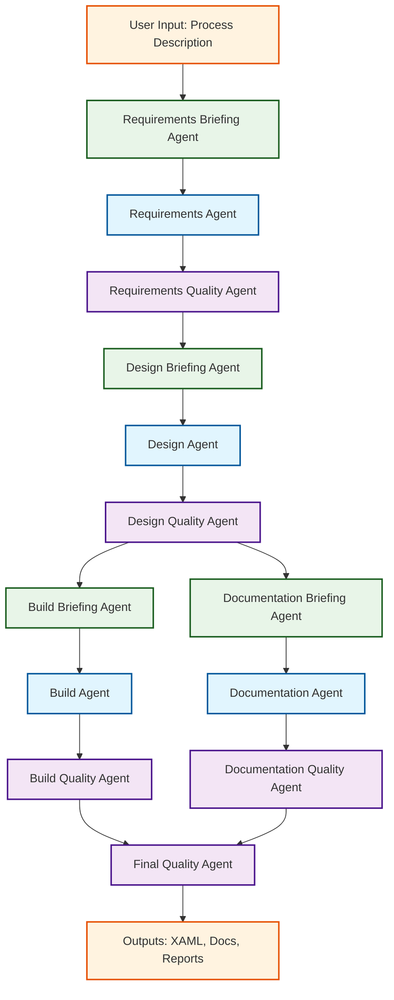
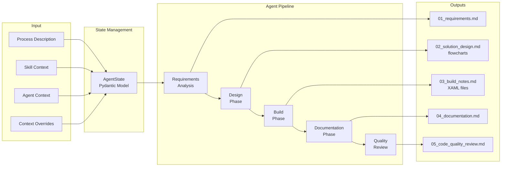

ü# UiPath Multi-Agent System Architecture

## Overview

The UiPath Multi-Agent Automation Builder is an intelligent system that transforms natural language process descriptions into complete UiPath RPA solutions. The system employs a sequential pipeline of specialized agents, each handling a specific phase of the automation development lifecycle.

## Agent Pipeline Architecture



## Agent Roles and Responsibilities

### Briefing Agents
- **Requirements Briefing**: Initial process analysis and entity extraction
- **Design Briefing**: Architecture preparation and context loading
- **Build Briefing**: Build environment setup and validation
- **Documentation Briefing**: Documentation structure planning

### Core Agents
- **Requirements Agent**: Comprehensive requirements gathering and analysis
- **Design Agent**: Solution architecture and flowchart generation
- **Build Agent**: UiPath XAML workflow and project file generation (uses skill context from `uipath-rpa-workflows` for templates and best-practice patterns)
- **Documentation Agent**: Technical and user documentation creation

### Quality Agents
- **Requirements Quality**: Requirements validation and completeness check
- **Design Quality**: Architecture review and best practices validation
- **Build Quality**: Code quality assessment and testing recommendations
- **Documentation Quality**: Documentation completeness and accuracy review
- **Final Quality**: Overall solution assessment and business case evaluation

## Data Flow



## Technical Architecture

### Core Technologies
- **LangGraph**: Agent orchestration and state management
- **Pydantic**: Data validation and state modeling
- **Python 3.9+**: Runtime environment
- **OpenAI API**: Optional LLM integration for enhanced analysis

### Key Components

#### State Management
```python
class AgentState(BaseModel):
    process_description: str
    skill_context: str
    agent_context: dict
    context_overrides: dict
    requirements: dict
    design: dict
    build: dict
    documentation: dict
    quality: dict
    human_gates: dict
    errors: list
```

#### Agent Pattern
Each agent follows this pattern:
1. Load system prompt from `prompts/`
2. Process input state
3. Apply business logic or LLM calls
4. Update state with results
5. Generate output files
6. Present human gate for approval

#### Configuration
- Environment-based model selection (`LLM_MODEL`)
- Optional API key for LLM features
- Skill context integration from UiPath knowledge base

## Human-in-the-Loop Integration

The system includes strategic approval points:
- Requirements approval (requirements quality gate)
- Design validation (design quality gate)
- Build confirmation (build quality gate)
- Documentation review (documentation quality gate)

Each gate allows users to provide feedback or override decisions.

## Build Agent Skill Context

The Build Agent integrates with the UiPath skill repository `uipath-rpa-workflows` to:
- apply standard XAML templates
- use proven activities and selectors
- leverage orchestration best practices
- respect error handling patterns from the skill knowledge base

## Parallel and Asynchronous Phase Behavior

After the design quality gate is passed, the pipeline branches:
- Build phase (build briefing → build agent → build quality) can run concurrently with
- Documentation phase (documentation briefing → documentation agent → documentation quality)

Both branches converge at the final quality agent for overall solution validation.

## Extensibility

The modular architecture supports:
- Adding new agent types
- Custom prompt engineering
- Alternative LLM providers
- Domain-specific skill contexts
- Additional quality metrics

## Deployment Options

- **Local Development**: Run `python main.py` with Python environment
- **Containerized**: Docker deployment with pre-configured dependencies
- **Cloud Integration**: Potential API service for enterprise deployment

## Quality Assurance

- Syntax validation for all generated code
- Comprehensive test coverage for agent logic
- Human review gates at critical decision points
- Automated quality scoring and recommendations