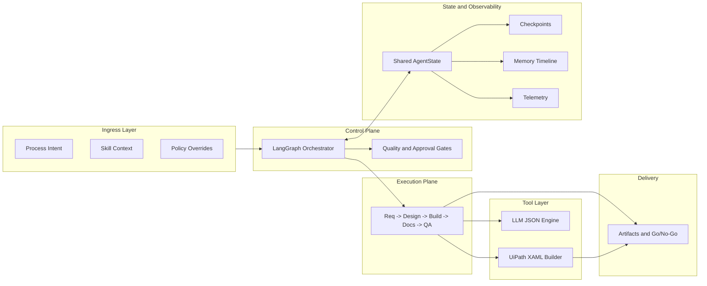

# UiPath Multi-Agent System

## Executive Summary

This platform converts a business process description into a governed RPA delivery package across five stages: Requirements, Design, Build, Documentation, and Quality.

Business outcome:
- Faster delivery cycle from idea to implementation package
- Higher consistency through standardized handovers
- Better control through quality gates and approvals

Technical outcome:
- LangGraph-based orchestration with explicit agent nodes and conditional routing
- Shared state data contracts with stage handovers
- Runtime recoverability through checkpoints, telemetry, and memory timeline
- Agent composition contract with explicit skill/role, context packet, and toolset per stage agent

## System Architecture Highlights

The architecture includes:
1. A full agent node catalog (core stage nodes, approval nodes, and terminal nodes)
2. End-to-end system flow with conditional branches
3. Explicit handover data flow between requirements, design, build, documentation, and quality
4. Embedded technical structure visual (ingress, orchestration, runtime, delivery, tooling)
5. Tool layer separation so execution capabilities are called as standalone tools, not embedded in agent logic

## Architecture At A Glance

## Agent Composition Model

Each stage agent is composed of:
1. Skill or role: domain responsibility and decision scope.
2. Context: phase context, shared skill context, and run metadata.
3. Tools: explicit executable capabilities used by the agent.

Build-stage example:
1. Build agent role: UiPath workflow engineer.
2. Build context: approved design decisions and project routing state.
3. Build tools: UiPath XAML builder tool that generates project.json, Main.xaml, sub-workflows, and architecture notes.

## UiPath Delivery Capability

The solution is designed to:
1. Understand and apply UiPath REFramework decision criteria
2. Recognize and model Dispatcher/Performer topologies when queue-based patterns are required
3. Generate `.xaml` workflow artifacts and activity-oriented build guidance through a dedicated UiPath XAML builder tool

## Core Documentation

- [ARCHITECTURE.md](ARCHITECTURE.md): Single technical source of truth with:
	- LangGraph framework structure
	- Agent node catalog and system flow
	- Data flow and handover contracts
	- Agent skill/role/context/tools composition model
	- Tool layer and build-tool invocation path
	- Runtime reliability and observability model
	- UiPath REFramework / Dispatcher-Performer / XAML capability model

## Scope Note

This repository is a management and architecture summary. Implementation details, examples, and code-level references are maintained separately in the source repository.
