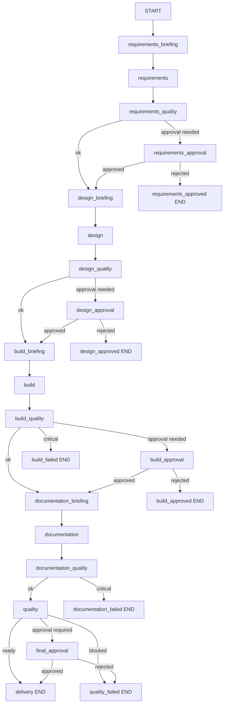

# UiPath Multi-Agent System Architecture

## 1. Purpose and Scope

This architecture describes a component-based agent system that converts process intent into implementation artifacts with governance, traceability, and recovery built into runtime.

Scope:
1. Component contracts
2. Stage orchestration model
3. Runtime reliability model
4. Governance and risk controls
5. Operational metrics

## 2. Component Architecture

| Component | Inputs | Outputs | Failure Signal | Business Value |
|---|---|---|---|---|
| Orchestrator | AgentState, routing policies | Next node transition | Terminal failure route | Predictable lifecycle |
| Shared State | Stage outputs, quality signals | Unified state snapshot | Contract mismatch | Consistent handover |
| Requirements Agent | Process description | Requirements artifact + open questions | Missing core semantics | Faster discovery |
| Design Agent | Requirements + quality context | Architecture decisions | Incomplete decisions | Better implementation fit |
| Build Agent | Design and policy context | UiPath scaffold + build notes | Build blockers | Accelerated delivery |
| Documentation Agent | Upstream artifacts | Runbook and ops documentation | Documentation blockers | Operational readiness |
| Quality Agent | All stage artifacts | Go/no-go decision package | Delivery blocked | Controlled release risk |
| Governance Nodes | Quality blockers/readiness | Approval outcome | Rejection/block state | Human risk control |
| Runtime Layer | State transitions | Checkpoints, telemetry, memory snapshots | Persist/serialization failure | Auditability and recovery |
| Prompt/LLM Layer | Stage prompt + reasoning context | Structured JSON augmentation | Parse/schema failure | Better content depth |

## 3. Orchestration Topology

Execution classes:
- Standard path: all quality thresholds met
- Escalation path: explicit human approval required
- Failure path: critical blockers terminate run

## 4. State and Interface Contracts

Shared state domains:
1. Inputs: process_description, project_dir, skill_context
2. Stage artifacts: requirements, design, build, documentation, quality
3. Control signals: stage_quality_checks, human_gates, lifecycle_handover
4. Runtime signals: run_id, run_meta, telemetry, agent_memory, errors

Node contract:
1. Accept AgentState
2. Return partial update or full state
3. Orchestrator merges updates into active state
4. Runtime metadata must remain additive and serializable

## 5. LLM Integration Contract

Policy controls:
- LLM_FIRST=true: model-first, deterministic fallback
- LLM_REQUIRED=true: fail run when model is unavailable

Invocation pipeline:
1. Build reasoning context from current state
2. Load stage prompt
3. Invoke model
4. Parse JSON payload
5. Validate required keys
6. Retry with backoff
7. Merge valid fields into stage baseline

Quality safeguard:
- Any parse/schema failure defaults to deterministic output continuity

## 6. Runtime Reliability and Memory

Node instrumentation lifecycle:
1. Start stage timer
2. Execute node
3. Persist checkpoint
4. Append telemetry event
5. Append compact memory snapshot
6. Handle failure with failed checkpoint + error telemetry

Artifacts:
- Checkpoint: full recovery state
- Telemetry: event timeline and durations
- Memory stream: compact phase-level evolution trace

## 7. Governance and Decision Control

Control points:
1. Requirements approval gate
2. Design approval gate
3. Build approval gate
4. Final approval gate

Decision outcomes:
- Approved: continue to next stage
- Rejected: terminal end node
- Blocked: fail path with explicit blocker context

## 8. Operational Metrics and Reporting

Technical metrics:
1. Node duration distribution
2. Error frequency by stage
3. Resume frequency
4. Fallback frequency

Management metrics:
1. Delivery readiness rate
2. Escalation rate
3. Blocker concentration by stage
4. Throughput (runs per period)

Use these metrics to tune routing policy, approval thresholds, and model/fallback strategy.

## 9. Risk Model and Controls

Primary risks:
1. LLM schema drift
2. Approval bypass or weak governance discipline
3. Runtime persistence issues
4. Prompt drift over time

Controls:
1. Schema-key validation + retries
2. Mandatory gate nodes for escalation paths
3. Persistent runtime artifacts for audit/replay
4. Deterministic fallback to maintain continuity

## 10. Extension Blueprint

To add capabilities without destabilizing runtime:
1. Add stage node and stage artifact keys
2. Add quality criteria for the new stage
3. Add routing rule and optional approval gate
4. Extend telemetry and memory summary fields
5. Keep state evolution backward compatible
