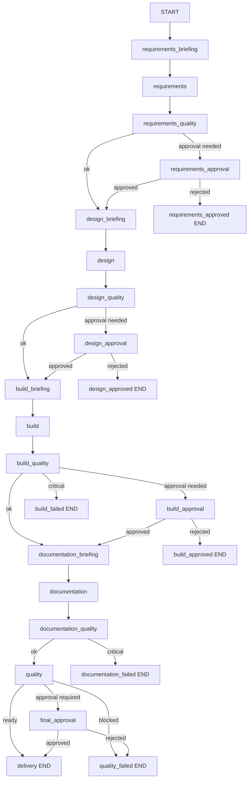

# UiPath Multi-Agent System Architecture

## Scope

This document defines runtime components and contracts for the agent pipeline.

## Component Map

| Component | Module(s) | Responsibility |
|---|---|---|
| Graph compiler | graph/orchestrator.py | Builds LangGraph state machine and node wiring |
| Shared state | core/state.py | Typed state exchanged across all nodes |
| Runtime layer | core/runtime.py | Run lifecycle, checkpointing, resume, telemetry, memory snapshots |
| Core agents | agents/requirements_agent.py, agents/design_agent.py, agents/build_agent.py, agents/documentation_agent.py, agents/quality_agent.py | Stage-specific generation and quality preparation |
| Governance nodes | agents/approval_gates.py, agents/end_nodes.py | Human approvals and terminal routing |
| Routing policy | utilities/conditional_routing.py | Conditional edge decisions from quality and approvals |
| Prompt loader and LLM policy | core/utils.py, prompts/*.md | Prompt resolution and schema-constrained LLM invocation |

## Execution Topology

## State Contract

AgentState domains:
- Inputs: process_description, skill_context, project_dir
- Stage outputs: requirements, solution_design/design, build_artifacts/build, documentation, code_quality_review
- Coordination: briefings, lifecycle_handover, stage_quality_checks, human_gates
- Runtime: run_id, run_meta, telemetry, agent_memory, errors

Node return contract:
- Node returns partial state dict or AgentState.
- Orchestrator merges partial output into current state.
- Runtime metadata is preserved when not returned explicitly by a node.

## Node Instrumentation

Every node is wrapped by runtime instrumentation.

Per-node behavior:
1. Initialize run metadata.
2. Skip node if already completed in resumed run.
3. Execute node and measure duration.
4. Mark node completed.
5. Append telemetry event.
6. Save checkpoint.
7. Save failure checkpoint and error telemetry on exception.

## LLM Invocation Contract

Policy:
- LLM_FIRST controls model-first behavior.
- LLM_REQUIRED controls fail-fast behavior if model is unavailable.

Invocation path:
1. Build reasoning context packet from current state.
2. Invoke model with system prompt and user prompt.
3. Parse JSON object from response.
4. Validate required keys.
5. Retry with exponential backoff when validation or parse fails.
6. Merge structured response into deterministic baseline.

## Prompt Subsystem

### Prompt files

- Location: prompts/
- Naming: <agent_name>_system.md
- Stage prompts:
    - requirements_system.md
    - design_system.md
    - build_system.md
    - documentation_system.md
    - quality_system.md

### Prompt loading contract

- Loader: core/utils.py -> load_system_prompt(agent_name)
- Prompts are loaded per stage and can be cached in agent_context.

### Runtime context override contract

- Overrides are injected through state.context_overrides.
- Agent stage context resolution uses state.get_phase_context(phase).
- Override precedence is higher than default agent_context.

## Stage Capability Baseline

### Requirements stage

- Extracts entities from user description (systems, time patterns, trigger semantics).
- Produces business rules, exceptions, assumptions, and open questions.
- Supports one-question-at-a-time clarification loop.
- Emits enriched sections such as acceptance criteria, non-functional requirements, data contracts, and monitoring KPIs.

### Design stage

- Derives architecture choice and complexity profile.
- Evaluates REFramework and dispatcher/performer applicability.
- Produces component blueprint, security controls, test strategy, deployment strategy, and observability plan.

### Build stage

- Generates UiPath project scaffold and workflow files.
- Uses project_dir from state (default outputs/uipath_project).
- Persists build notes and architecture guidance for generated workflows.

### Documentation stage

- Produces operational documentation with runbook orientation.
- Includes SLA expectations, test matrix, rollback plan, troubleshooting, and maintenance guidance.

### Quality stage

- Performs final readiness review and release gating.
- Emits severity findings, test gaps, go/no-go criteria, blockers, and recommendations.

## Consolidated Improvements

Current architecture includes these system-level improvements:

1. LLM-first with deterministic fallback and schema validation retries.
2. Explicit stage handovers with reasoning context packets.
3. Conditional routing and approval gates for governance-aware flow control.
4. Node-level checkpointing with resume support.
5. Checkpoint-derived agent memory stream for replayable run context.
6. Telemetry capture for node timing, status, and error traces.
7. Configurable use-case project output directory via CLI/environment.

## Checkpoint, Memory, and Telemetry

### Checkpoint

- Path: artifacts/checkpoints/<run_id>/<node>.json
- Payload: full serialized AgentState
- Purpose: resume and forensic recovery

### Agent memory

- Path: artifacts/memory/<run_id>.ndjson
- Entry schema: timestamp, run_id, checkpoint_node, failed, phase, project_dir, summary metrics
- Purpose: compact replay timeline of run evolution

### Telemetry

- Path: artifacts/telemetry/<run_id>.json
- Contains: run metadata, node events, errors, accumulated agent memory

## Generated Functional Artifacts

- outputs/01_requirements.md
- outputs/02_solution_design.md
- outputs/03_build_notes.md
- outputs/04_documentation.md
- outputs/05_code_quality_review.md
- UiPath scaffold in outputs/uipath_project or USE_CASE_PROJECT_DIR

## Extension Points

1. Add node: create agent module and register in graph/orchestrator.py.
2. Add routing rule: implement function in utilities/conditional_routing.py and wire conditional edge.
3. Add state field: extend AgentState and preserve compatibility in runtime merge.
4. Add LLM schema: define required keys and merge rules in the target agent.
5. Add memory metric: extend snapshot summary in core/runtime.py.