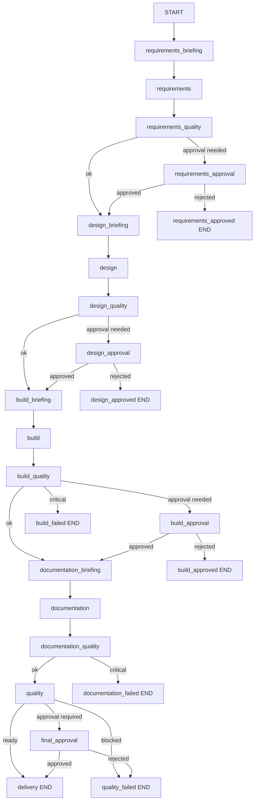

# UiPath Multi-Agent System Architecture

## 1. Executive Summary

This platform converts one business process description into a controlled delivery package:

- Requirements
- Solution design
- Build artifacts (UiPath scaffold)
- Operational documentation
- Quality gate review

The architecture is designed to balance delivery speed and governance.

Management outcomes:
- Predictable stage-based delivery
- Human approvals at risk boundaries
- Full run traceability through checkpoints, memory timeline, and telemetry
- Clear readiness signal (delivery-ready vs blocked)

Technical outcomes:
- Typed state contract across all nodes
- Conditional orchestration with explicit failure routes
- LLM-first generation with deterministic fallback
- Resume and replay support from persisted runtime artifacts

## 2. Architecture Goals

Primary goals:
1. Convert unstructured process input into executable artifacts.
2. Keep each stage auditable and resumable.
3. Enforce quality gates before promotion to next stage.
4. Provide deterministic continuation when LLM is unavailable.
5. Keep extension cost low for new stages, policies, and models.

Non-goals:
- Real-time event streaming orchestration
- Multi-tenant runtime isolation
- In-process secret vaulting

## 3. System Components

| Component | Module(s) | Technical Responsibility | Management Value |
|---|---|---|---|
| Orchestrator | graph/orchestrator.py | Build and execute LangGraph workflow, wire conditional edges | Standardized lifecycle across projects |
| Shared State | core/state.py | Maintain typed cross-stage state contract | Consistent reporting and handoff quality |
| Runtime Layer | core/runtime.py | Checkpointing, resume, memory snapshots, telemetry persistence | Auditability, recoverability, SLA diagnostics |
| Stage Agents | agents/requirements_agent.py, agents/design_agent.py, agents/build_agent.py, agents/documentation_agent.py, agents/quality_agent.py | Stage-specific generation and review logic | Clear phase ownership and accountability |
| Governance Nodes | agents/approval_gates.py, agents/end_nodes.py | Human gate decisions and terminal states | Risk control before delivery |
| Routing Policy | utilities/conditional_routing.py | Branch execution using quality and approval outcomes | Policy-driven operational control |
| Prompt + LLM Policy | prompts/*.md, core/utils.py | Prompt loading, JSON extraction, schema-key validation, retries | Controllable AI behavior and quality consistency |

## 4. End-to-End Execution Topology

Operational interpretation:
- Green path: stage quality passes, no escalation required.
- Yellow path: approval required due to policy or blockers.
- Red path: critical blocker forces terminal failure node.

## 5. State and Contract Model

Core state domains in AgentState:
- Inputs: process_description, skill_context, project_dir
- Stage artifacts: requirements, solution_design/design, build_artifacts/build, documentation, code_quality_review
- Coordination: briefings, lifecycle_handover, stage_quality_checks, human_gates
- Runtime: run_id, run_meta, telemetry, agent_memory, errors

Node output contract:
1. Nodes return partial dict updates or AgentState.
2. Orchestrator merges partial updates into the active state.
3. Runtime metadata is preserved if a node omits those fields.

Governance contract:
- human_gates tracks explicit stage approvals and final approval status.
- stage_quality_checks stores issues, blockers, and readiness signals consumed by routing policy.

## 6. Runtime Reliability Model

Each node is runtime-instrumented with the following sequence:
1. Initialize run metadata.
2. Skip completed node if resuming from checkpoint.
3. Execute node and capture duration.
4. Mark node completed.
5. Append telemetry event.
6. Save checkpoint snapshot.
7. On exception, append error telemetry and save failed checkpoint.

Reliability characteristics:
- Restartable from latest checkpoint.
- Deterministic re-entry for completed-node skip behavior.
- Traceable error lineage through node-scoped telemetry.

## 7. LLM and Prompting Architecture

Policy controls:
- LLM_FIRST=true: prefer model output, fallback to deterministic logic when needed.
- LLM_REQUIRED=true: fail run if model is unavailable.

Invocation pipeline:
1. Build reasoning context packet from current state.
2. Load stage system prompt from prompts/<agent>_system.md.
3. Invoke model.
4. Parse JSON object from response text.
5. Validate required keys.
6. Retry with exponential backoff for parse/schema failures.
7. Merge valid structured data into stage baseline output.

Prompt override model:
- state.context_overrides provides explicit phase overrides.
- state.get_phase_context(phase) resolves precedence over default agent_context.

## 8. Stage Responsibilities

Requirements stage:
- Entity extraction (systems, timelines, triggers)
- Business rules and exception capture
- Clarification workflow and acceptance/NFR/KPI shaping

Design stage:
- Architecture selection and complexity classification
- REFramework and dispatcher/performer decisions
- Security, testing, deployment, observability plans

Build stage:
- UiPath scaffold generation and workflow output
- Project directory routing from project_dir (default outputs/uipath_project)

Documentation stage:
- Runbook-oriented operational documentation
- SLA/test matrix/rollback and troubleshooting guidance

Quality stage:
- Final release-readiness review
- Severity findings, blockers, go/no-go criteria, and recommendations

## 9. Artifacts and Observability

Functional outputs:
- outputs/01_requirements.md
- outputs/02_solution_design.md
- outputs/03_build_notes.md
- outputs/04_documentation.md
- outputs/05_code_quality_review.md
- UiPath scaffold in outputs/uipath_project or USE_CASE_PROJECT_DIR

Runtime outputs:
- artifacts/checkpoints/<run_id>/<node>.json
- artifacts/memory/<run_id>.ndjson
- artifacts/telemetry/<run_id>.json

Checkpoint-as-memory model:
- Checkpoint stores full state for recovery.
- Memory stream stores compact timeline entries (node, phase, summary metrics).
- Telemetry stores event-level execution history and accumulated memory.

## 10. Management Dashboard Metrics

Recommended KPI set:
1. Delivery readiness rate: ready runs / total runs.
2. Approval escalation rate: runs requiring human gates / total runs.
3. Mean stage duration by node.
4. Failure concentration by terminal node.
5. Rework indicator: resumed runs / total runs.
6. LLM fallback rate: deterministic fallbacks / total stage executions.

Decision support usage:
- Use escalation and blocker trends to tune policy thresholds.
- Use stage duration drift to prioritize optimization work.
- Use fallback rate to decide model reliability and fail-fast policy.

## 11. Risk and Control Model

Key risks:
- LLM schema drift causing low-quality merges.
- Incomplete approvals leading to premature delivery.
- Operational drift in prompts/configuration over time.

Controls:
1. Required-key schema validation with retries.
2. Explicit approval nodes and terminal blocked paths.
3. Persistent telemetry and memory timeline for audits.
4. Deterministic fallback paths for model outages.

## 12. Change and Extension Strategy

Extension steps:
1. Add node and register in orchestrator.
2. Add routing function and conditional edges.
3. Extend AgentState if new shared fields are required.
4. Add LLM schema keys and merge policy in target stage.
5. Extend memory snapshot schema if new management metrics are needed.

Backward-compatibility rules:
- Do not break existing AgentState keys consumed by routing nodes.
- Keep checkpoint payloads JSON-serializable.
- Keep telemetry event schema additive, not destructive.